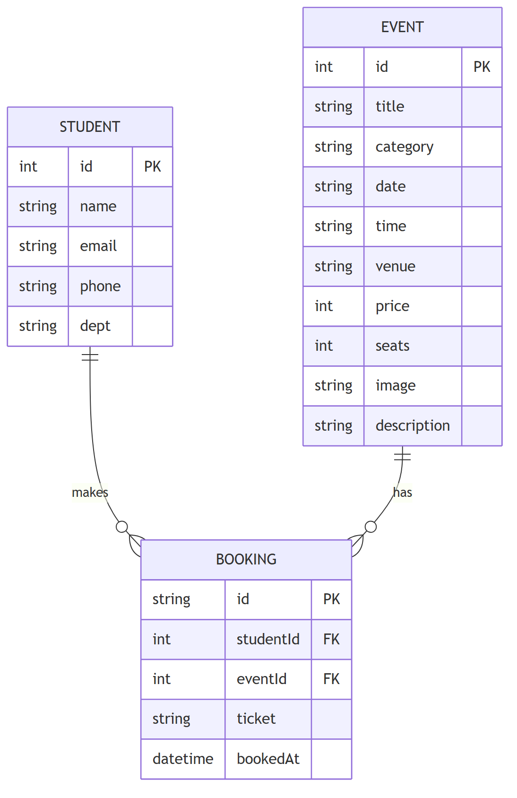

# Entity-Relationship Diagram

## Entities

| Entity   | Description                                                  |
|----------|--------------------------------------------------------------|
| STUDENT  | The person registering for an event.                         |
| EVENT    | A campus event open for registration.                        |
| BOOKING  | A single student's registration for a single event.          |

## Relationships

| Relationship       | Cardinality | Meaning                                       |
|--------------------|-------------|-----------------------------------------------|
| STUDENT → BOOKING  | 1 : N       | One student may make many bookings.           |
| EVENT → BOOKING    | 1 : N       | One event may receive many bookings.          |

`BOOKING` is an associative entity that resolves the many-to-many
relationship between `STUDENT` and `EVENT`: a student may register for many
events, and an event may be booked by many students.

## Notation

- `PK` — Primary Key, uniquely identifies a row.
- `FK` — Foreign Key, references another entity's primary key.
- The crow's-foot symbol (`{`) at the `BOOKING` end of each line denotes
  the "many" side of the relationship.

## Implementation Note

In this demo, data is stored in the browser using `localStorage` rather
than a relational database. As a result, the student attributes are kept
inside the booking object rather than in a separate table. The conceptual
model shown above represents the schema a database-backed version of this
project would use.
